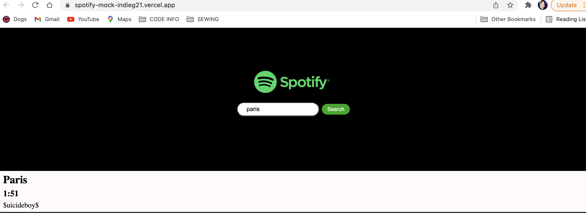

# SPOTIFY-MOCK APP
A Spotify clone app using the Spotify API.  

## About The Project
A Spotify clone app using the Spotify API. Allowing the user to search for songs and click a link to listen to the song in a new tab.

## Built With

- Create-react-app
- HTML / CSS

## Prerequisites
 - Git
 - Node.js
 - NPM

## Credit

👤 **India G**

-   Github: [indieg21](https://github.com/indieg21)
-   Twitter: [@IndieTheTechGi1](https://twitter.com/IndieTheTechGi1)
-   Linkedin: [linkedin](https://www.linkedin.com/in/india-g-a9046b78/)
-   <Indiagraham21@gmail.com>
-   <https://indieart.myportfolio.com/>

## Screenshots

## Usage

- git clone git@github.com:indieg21/SPOTIFY-MOCK.git

- cd SPOTIFY-MOCK

- npm install

- npm start

## Live Version

[Live Demo Link](https://spotify-mock-indieg21.vercel.app/)

## Show your support

Give a ⭐️ if you like this project!
